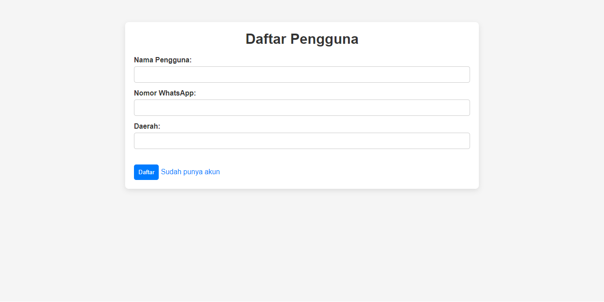
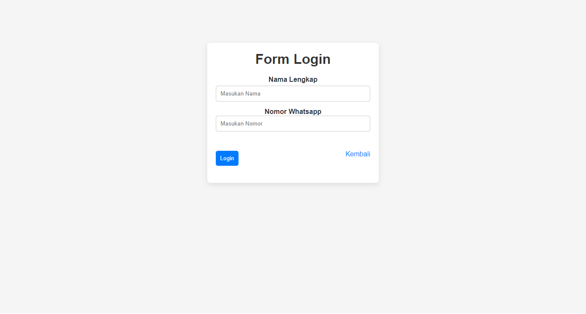
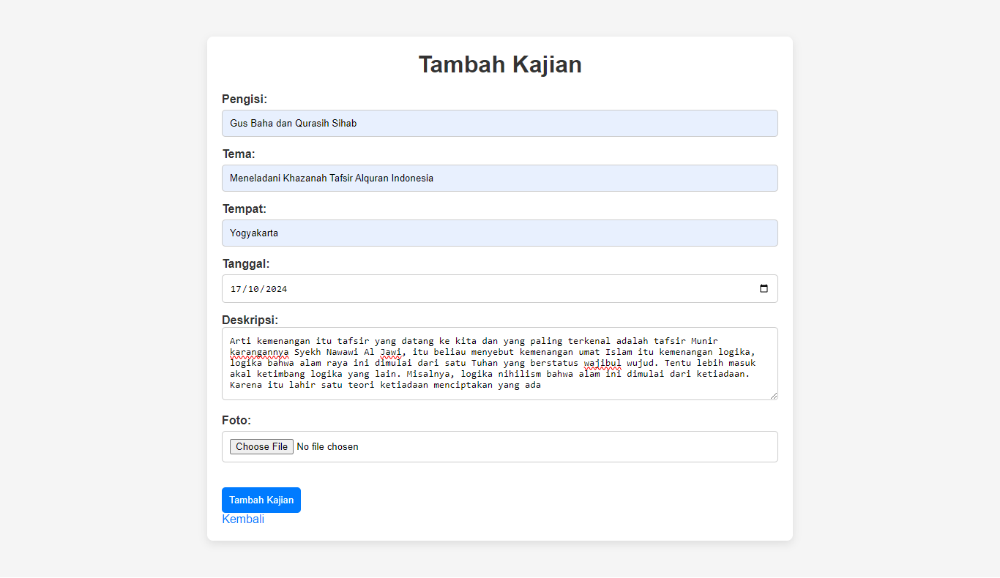
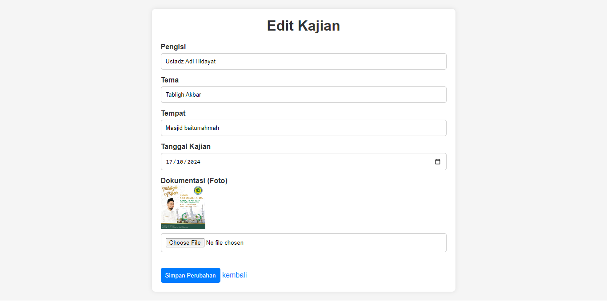
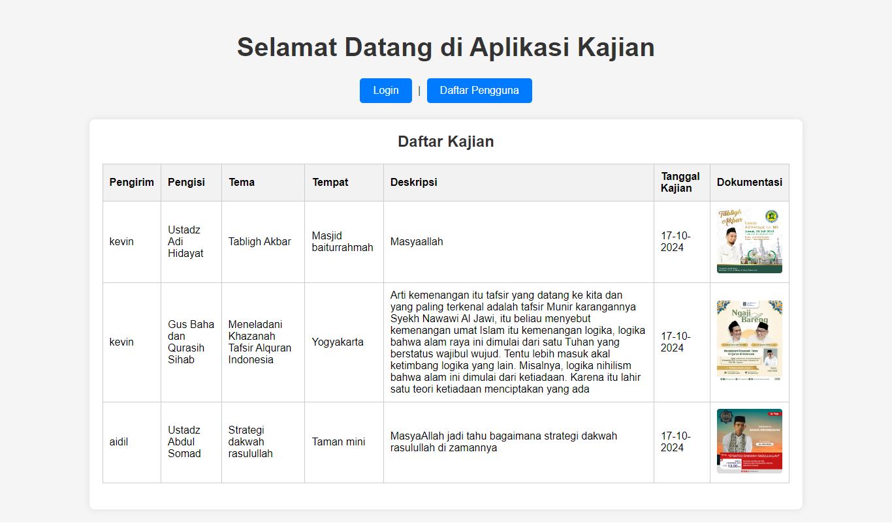

# Aplikasi Kajian

Aplikasi Kajian ini memungkinkan pengguna untuk menambahkan, mengedit, dan melihat daftar kajian. Pengguna harus melakukan login untuk menambah atau mengedit data kajian.

## Fitur Utama

1. **Daftar Pengguna**: Pengguna baru dapat mendaftarkan diri menggunakan form yang tersedia.
2. **Login**: Pengguna yang sudah terdaftar dapat login ke aplikasi.
3. **Tambah Kajian**: Setelah login, pengguna dapat menambahkan kajian baru dengan mengisi detail seperti pengisi, tema, tempat, tanggal, dan deskripsi.
4. **Edit Kajian**: Pengguna yang sudah menambahkan kajian dapat memperbarui data kajian yang sudah ada.
5. **Daftar Kajian**: Semua kajian yang sudah ditambahkan akan ditampilkan dalam bentuk tabel.

## Struktur Halaman

### 1. Halaman Daftar Pengguna (`user.php`)
Form untuk pengguna baru yang belum memiliki akun.

- **Input**:
  - Nama Pengguna
  - Nomor WhatsApp
  - Daerah

- **Tombol**: Daftar

### 2. Halaman Login (`login.php`)
Form untuk pengguna yang sudah memiliki akun untuk login ke sistem.

- **Input**:
  - Nama Lengkap
  - Nomor WhatsApp

- **Tombol**: Login

### 3. Halaman Tambah Kajian (`tambah_kajian.php`)
Form untuk menambahkan kajian baru.

- **Input**:
  - Pengisi
  - Tema
  - Tempat
  - Tanggal Kajian
  - Deskripsi
  - Dokumentasi (Foto)

- **Tombol**: Tambah Kajian

### 4. Halaman Edit Kajian (`edit_kajian.php`)
Form untuk memperbarui kajian yang sudah ada.

- **Input**:
  - Pengisi
  - Tema
  - Tempat
  - Tanggal Kajian
  - Dokumentasi (Foto)

- **Tombol**: Simpan Perubahan

### 5. Halaman Daftar Kajian (`index.php`)
Menampilkan daftar semua kajian yang telah ditambahkan oleh pengguna.

- **Kolom**:
  - Pengirim
  - Pengisi
  - Tema
  - Tempat
  - Deskripsi
  - Tanggal Kajian
  - Dokumentasi (Foto)

## Alur Kerja

1. Pengguna baru mendaftarkan akun melalui halaman pendaftaran.
2. Pengguna login ke sistem menggunakan nama lengkap dan nomor WhatsApp.
3. Setelah login, pengguna dapat menambah kajian atau memperbarui kajian yang sudah ada.
4. Daftar kajian dapat dilihat oleh semua pengguna.

## Teknologi yang Digunakan

- PHP untuk backend dan pemrosesan data.
- HTML dan CSS untuk frontend.
- MySQL untuk penyimpanan data kajian dan pengguna.
- Session management untuk autentikasi pengguna.

## Cara Menggunakan

1. Clone repositori ini.
2. Buat database di MySQL dengan struktur tabel yang sesuai.
3. Konfigurasikan koneksi database di file `cd/config.php`.
4. Jalankan aplikasi di server lokal (misalnya XAMPP atau LAMP).
5. Akses halaman utama untuk login atau daftar pengguna baru.

